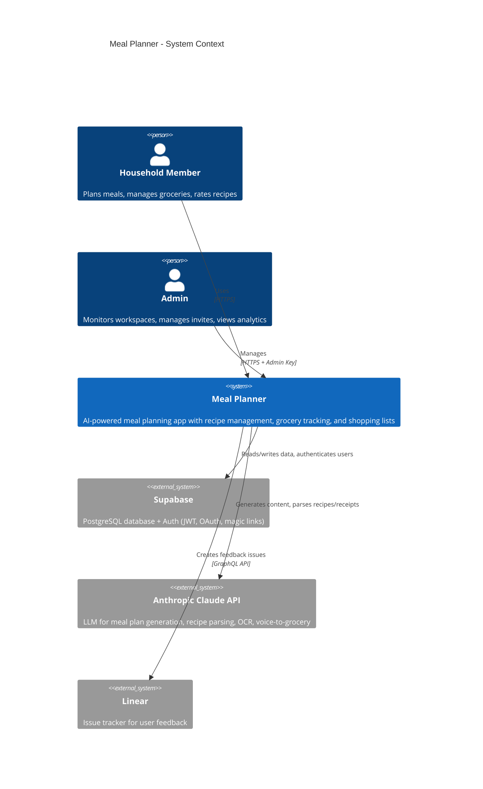
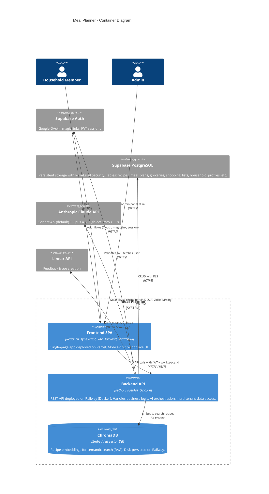
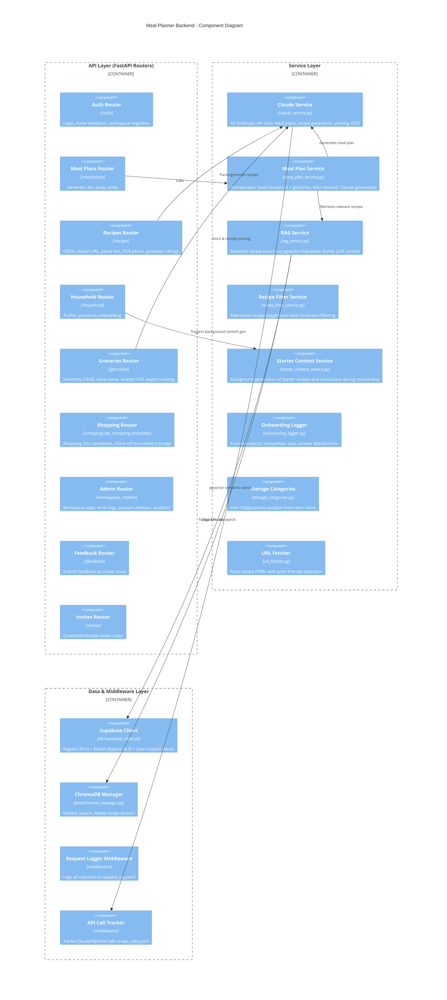
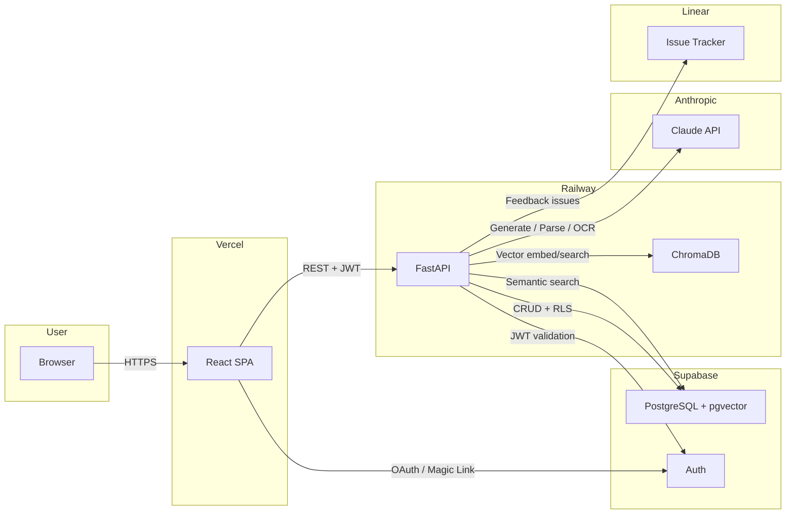

# Meal Planner — C4 Architecture Diagrams

This document describes the Meal Planner system architecture using C4 model diagrams (Context, Container, Component). Each level zooms in further, from the bird's-eye view down to internal backend and frontend structure.

> **Rendering:** These diagrams use Mermaid syntax. View them in GitHub's markdown preview, VS Code with a Mermaid extension, or paste into [mermaid.live](https://mermaid.live).

---

## Level 1: System Context

The system context shows who interacts with the Meal Planner and what external services it depends on.



---

## Level 2: Container Diagram

The container diagram breaks the system into its major deployable units — the React SPA on Vercel, the FastAPI backend on Railway, embedded ChromaDB for vector search, and the external services.



---

## Level 3: Component — Backend

This diagram shows the internal structure of the FastAPI backend, organized into three layers: API routers, services, and data/middleware.



---

## Level 3: Component — Frontend

The frontend is a React SPA organized into pages, state management, an API client layer, and shared components/hooks.

```mermaid
C4Component
    title Meal Planner Frontend - Component Diagram

    Container_Boundary(pages, "Pages (React Router)") {
        Component(index_page, "Index / Dashboard", "/", "Home with onboarding entry, quick stats")
        Component(mealplan_page, "Meal Plans", "/meal-plans", "Generate, view, swap recipes in plans")
        Component(recipe_page, "Recipes", "/recipes", "Browse, create, import, rate recipes")
        Component(grocery_page, "Groceries", "/groceries", "Inventory tab + Shopping List tab")
        Component(household_page, "Household", "/household", "Family members, preferences, daycare rules")
        Component(cook_page, "Cook", "/cook", "Cooking preferences")
        Component(admin_page, "Admin", "/a", "Workspace analytics, error logs")
        Component(auth_pages, "Auth Pages", "/login, /signup, /auth/*", "Login, signup, OAuth callback, email verify")
    }

    Container_Boundary(state, "State Management") {
        Component(auth_ctx, "Auth Context", "AuthContext.tsx", "Session, user, workspace_id, login/logout")
        Component(react_query, "React Query", "TanStack Query v5", "Server state: queries + mutations per domain")
    }

    Container_Boundary(api_layer, "API Client Layer") {
        Component(api_client, "API Client", "lib/api.ts", "Fetch-based HTTP client. Modules: household, groceries, shopping, recipes, mealPlans, onboarding, admin")
        Component(auth_lib, "Auth Library", "lib/auth.ts", "Google OAuth, magic links, invite code validation, session management")
        Component(supa_client, "Supabase Client", "lib/supabase.ts", "Direct Supabase JS SDK for auth flows")
    }

    Container_Boundary(shared, "Shared Components & Hooks") {
        Component(layout, "AppLayout", "layout/AppLayout.tsx", "Header, desktop nav, mobile bottom nav, feedback modal")
        Component(guard, "WorkspaceGuard", "workspace/WorkspaceGuard.tsx", "Redirects unauthenticated users to /login")
        Component(hooks, "Custom Hooks", "hooks/", "useAutoSave, useVoiceInput, useNukeWithUndo, useMobile")
        Component(ui_lib, "shadcn/ui + Radix", "ui/", "50+ accessible UI primitives")
    }

    Rel(pages, react_query, "useQuery / useMutation")
    Rel(react_query, api_client, "Calls API functions")
    Rel(auth_pages, auth_lib, "Auth flows")
    Rel(auth_lib, supa_client, "Supabase Auth SDK")
    Rel(pages, auth_ctx, "useAuth()")
    Rel(pages, hooks, "Shared behavior")
    Rel(pages, ui_lib, "UI components")
    Rel(layout, guard, "Wraps protected routes")
```

---

## Data Flow Summary

A simplified end-to-end view of how a request flows from the browser through all system components.


